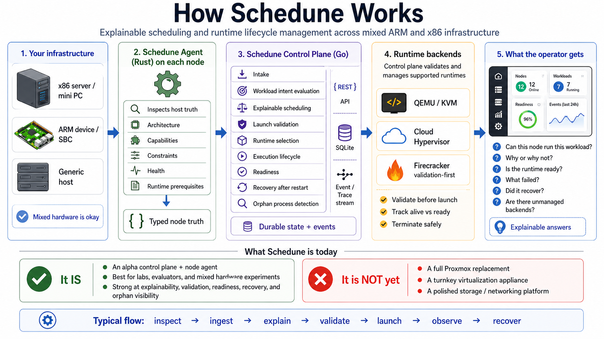

# Schedune

**Schedune is an alpha-stage control plane and node agent for explainable scheduling, launch validation, managed runtime lifecycle, restart recovery, and orphan visibility across heterogeneous ARM and x86 infrastructure.**

**Status:** v0.1.0-alpha / Experimental (Single-node technical preview)
**Community:** [Join the Schedune Discord](https://discord.gg/mdr8tyCQvc)
**Control Plane:** Go
**Agent:** Rust
**Persistence:** SQLite
**Supported Runtimes:**
- **KVM/QEMU:** Execute
- **Cloud Hypervisor:** Execute or Validate
- **Firecracker:** Validate / Dry-Run (Execution coming soon)

Unlike generic orchestrators or traditional hypervisors, Schedune is built specifically to help organizations exit expensive legacy virtualization, adopt ARM infrastructure safely, and manage mixed fleets with lower operational risk.



## What Schedune does today

- **Node capability ingestion:** Agent inspects and emits versioned node truth.
- **Workload eligibility explanation:** Explains why workloads are rejected.
- **Backend-aware launch validation:** Catches host-level and artifact-level blockers.
- **Runtime lifecycle management:** Persistent states, append-only traces.
- **Restart recovery:** Rehydrates active workloads after a crash, surfaces orphans.
- **Orphan visibility:** Explicit orphan detection sweeping without destructive actions.

## Quickstart

Get a single-node Schedune control plane and agent running in under 5 minutes.

### 1. Preflight Check

Check if your local host is ready for the evaluator:

```bash
make dev-preflight
```

### 2. Evaluator Demo (Linux)

If you are on a Linux host with KVM, run the end-to-end evaluator journey. This builds the components, starts the control plane, inspects your local node, ingests the truth, and evaluates a sample workload intent.

```bash
make demo
```

### 3. Evaluate from a MacBook / non-Linux host

On a MacBook M2 Air (or other non-Linux hosts), you can still test control-plane intake, scheduling explainability, launch validation against fixture truth, node APIs, and orphan API shape. Actual VM/microVM execution requires Linux with KVM and runtime binaries.

Run the fixture-backed evaluator demo to quickly verify the pipeline:

```bash
make demo-fixture-once
```

For an interactive session where you can explore the API manually afterwards, run:

```bash
make demo-fixture
```

### 3. Step-by-Step Examples

If you want to run it manually using the provided targets:

```bash
make dev-up                  # Start control plane in background
make example-intake          # Ingest your node capabilities
make example-schedule        # Run a scheduling explanation
make example-launch-validate # Validate a cloud-hypervisor launch
make example-launch-execute  # Execute a cloud-hypervisor launch
make example-orphans         # Check for orphaned processes
make dev-down                # Stop the control plane
```

## Repository Layout

- `schedune-control-plane/`: The Go-based control plane, API, and orchestration logic.
- `schedune-agent/`: The Rust-based node agent for inspection and capability emission.
- `docs/`: Technical documentation and schemas.
- `examples/`: Example launch specs, workload intents, and curl wrappers.
- `scripts/`: Helper scripts for demo and preflight checks.

## Design Principles

- **Agent emits truth; control plane projects truth.** The agent observes; it does not orchestrate.
- **Eligibility before scoring.** Workloads are explicitly rejected with exact reason codes.
- **Launch validation before execution.** Fails fast on missing dependencies or permissions.
- **State, trace, and events separate.** Predictable lifecycle tracking and append-only debugging.
- **Unknown is better than wrong.** If Schedune cannot verify a capability, it assumes it is absent.
- **Orphan processes are surfaced, not guessed at or destroyed.** Operators have visibility to resolve out-of-band state manually.

## Current Limitations

Schedune explicitly **does not** support:
- High Availability (HA) control plane
- Auto-orphan adoption
- Live migration
- Advanced guest-service readiness (only hypervisor readiness is tracked)

## Documentation

The full documentation is available in the `docs/` directory and can be built locally using MkDocs:

```bash
pip install -r docs/requirements.txt
mkdocs serve
```

- [Quickstart](docs/quickstart.md)
- [Architecture Overview](docs/architecture.md)
- [API Reference](docs/api.md)
- [Runtime Support](docs/runtime-support.md)
- [Troubleshooting](docs/troubleshooting.md)
- [State Machine](docs/state-machine.md)
- [Restart Recovery](docs/recovery.md)

## License

Copyright 2026 Technology Tailors. Licensed under the Apache License, Version 2.0.
